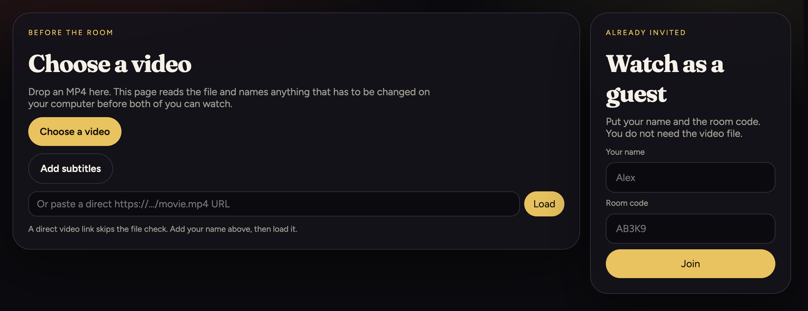
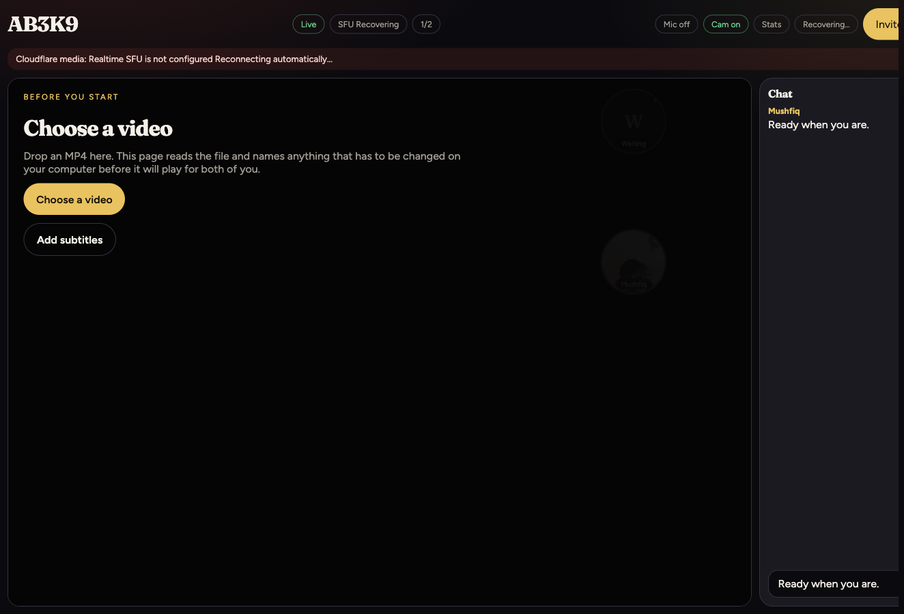
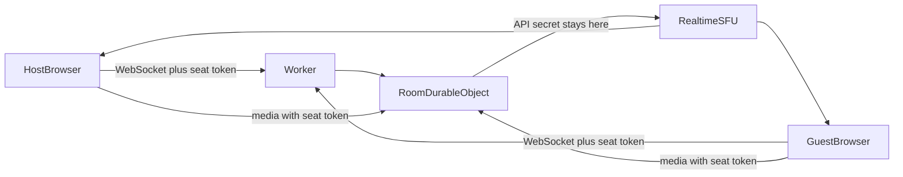

# Watch Party

A self-hosted watch party for two people. You deploy it on your own Cloudflare account with your own Realtime credentials. This repository does not host a public demo.

No accounts. Create a room, send `/r/AB3K9`, and watch together. Two people maximum. MP4 with **H.264 + AAC** is the supported codec.





The room screenshot was taken with no movie loaded. Chat is connected. The media line stays in that state until `CALLS_APP_SECRET` is set.

## What it does

- **Local file:** the host plays an MP4 in the browser and publishes its captured audio/video tracks through Cloudflare Realtime SFU. The guest never needs the file.
- **Direct URL:** both browsers play the same `https://…/movie.mp4` (or similar) and keep play/pause/seek in sync.
- **Webcams + chat** in the same room.
- **Synchronized soft subtitles:** the host can load an `.srt` or `.vtt`; active cues are relayed through the room and rendered over both players.
- Native `RTCPeerConnection` to Cloudflare Realtime SFU (not peer-to-peer and not PeerJS). One Durable Object per room, with WebSocket hibernation.
- Failed or interrupted media connections automatically discard the stale SFU session and reconnect with capped exponential backoff.

## Architecture



The Worker routes `/api/*` and `/ws/*`. Each room code names one Durable Object. That object holds the roster, playback state, chat, and the current subtitle cue, and it hibernates between WebSocket events.

When someone connects, the Durable Object issues a random media-seat token on that socket. The browser sends the token with every Realtime request. The Worker checks it against the live socket, then calls Cloudflare with `CALLS_APP_SECRET`. The API token never reaches client code. A request without a live seat is rejected.

URL mode does not proxy the movie. Both browsers fetch the `https` URL themselves. A local file stays on the host machine; only the captured media tracks cross the SFU.

## Security model

This is a private invite tool for a deployment you control. It is not a multi-tenant service, and the deployment URL should not be published as a public demo.

- **The invite link is the access control.** Anyone with `/r/CODE` can join until two people are connected. Room codes are 5 characters from a 32-character alphabet, about 33 million values. That is enough for a private invite. It is not enough to protect a public site.
- **The host key is a random UUID** stored in the browser. It is sent on the WebSocket query string, so it can appear in request logs. The invite path itself does not include it. Treat server logs as sensitive.
- **Secrets stay on the Worker.** `CALLS_APP_SECRET`, and the TURN key if you configure one, are Worker secrets or local `.dev.vars` values. The browser only receives a per-connection media-seat token and short-lived TURN credentials.
- **Chat and captions are visible to the other person in the room.** They are rendered as text, not HTML. Subtitle files are parsed in the host browser; only the active cue is relayed.
- **The Worker does not fetch movie URLs**, so a pasted link cannot be used to make the Worker request an internal address.

The committed `CALLS_APP_ID` is the placeholder `your-app-id`. Media setup returns "Realtime SFU is not configured" until that value is replaced and `CALLS_APP_SECRET` is set. Do not commit a real App ID.

## Local development

Requires Node.js 22.

```bash
npm install
cp .dev.vars.example .dev.vars
# Set CALLS_APP_ID and CALLS_APP_SECRET in .dev.vars to test media locally.
npm run dev
```

`.dev.vars` overrides the placeholder App ID for local dev and is gitignored. Open [http://localhost:5173](http://localhost:5173). Vite plus the Cloudflare plugin runs the React app and the Worker (including the Room Durable Object) together.

`wrangler dev` works against the production-like build:

```bash
npm run build
npx wrangler dev
```

### Two-browser test loop

1. Start `npm run dev`.
2. Browser A: enter a name, **Create a room**, allow camera/mic.
3. Copy the invite link.
4. Browser B (another profile or incognito): open the link, enter a name, allow camera/mic.
5. Confirm chat works both ways.
6. Host: paste a direct HTTPS MP4 URL, or drop a short local `.mp4`. Confirm the guest sees playback.
7. A third tab should be rejected (room full).

Use a short H.264 MP4. MKV/HEVC files are warned and often fail.

### Subtitles

After starting a movie, the host can open **Source** and choose **Add subtitles**. SRT and WebVTT files up to 2 MB are parsed locally; the original subtitle file is never uploaded. Only the current cue and timing are sent through the room WebSocket, so guests and late joiners see the same caption. Each viewer can toggle captions with the **CC** button.

### Choose the default movie language

Desktop Chrome does not reliably expose embedded MP4 audio-track selection to web apps. The stable option is to make a lossless copy with the preferred audio track first, then choose that copy in the watch party. Nothing is re-encoded, so quality is unchanged and the operation is much faster than transcoding.

List a movie's tracks without changing the file:

```bash
npm run audio:prefer -- "/path/to/movie.mp4"
```

Create a copy with English first (a track number such as `2` also works):

```bash
npm run audio:prefer -- "/path/to/movie.mp4" eng
```

The original file is never modified or overwritten. The new filename ends in `.eng-first.mp4`. The app's dialogue-safe 5.1 → stereo downmix still runs during playback.

## Cloudflare Realtime SFU

The media path is `browser → nearest Cloudflare edge → friend`. Browsers no longer need to discover or connect directly to one another, which avoids the NAT, hairpinning, and restrictive-network failures of a peer-to-peer backend.

1. In the Cloudflare dashboard open **Realtime** → **Serverless SFU** and create an application.
2. Replace the placeholder in `wrangler.jsonc` with your non-secret App ID. Do not commit that change if this checkout is a public clone of the repository:

```jsonc
"vars": { "CALLS_APP_ID": "your-app-id" }
```

3. Store the API token as a Worker secret. Never place it in client code or `wrangler.jsonc`:

```bash
npx wrangler secret put CALLS_APP_SECRET
```

For local media testing only, place `CALLS_APP_ID=…` and `CALLS_APP_SECRET=…` in the gitignored `.dev.vars` file.

### TURN fallback for restricted networks

The app uses Cloudflare STUN by default. For mobile carriers, corporate Wi-Fi, or other networks that block direct UDP, create a Cloudflare Realtime TURN key and store both values as Worker secrets:

```bash
npx wrangler secret put TURN_KEY_ID
npx wrangler secret put TURN_KEY_API_TOKEN
```

The Worker exchanges the long-lived TURN key for short-lived 24-hour browser credentials. The key never reaches client code. Clients try UDP first and can fall back to TURN over UDP, TCP port 80, or TLS port 443. If ICE still fails or the device changes networks, the app invalidates the stale SFU session and rebuilds it automatically; **Reconnect media** provides the same recovery manually.

Realtime SFU and TURN share Cloudflare's first 1,000 GB/month free allowance; additional egress is billed at the published Realtime rate. Client uploads are not billed as egress. See [Realtime SFU pricing](https://developers.cloudflare.com/realtime/sfu/pricing/). A personal deploy for two people fits that allowance. A public link does not: strangers would relay video through your account, and empty room codes can create Durable Objects.

## Deploy on your Cloudflare account

Replace `your-app-id` in `wrangler.jsonc` with your Realtime App ID before deploying. A deploy publishes that value. The placeholder will not connect to Realtime, and committing your real App ID puts it in the public repository. Secrets already stored with `wrangler secret put` are not removed by a later deploy.

```bash
npm run deploy
```

That builds the Vite app and runs `wrangler deploy`. After the first deploy:

1. Cloudflare Dashboard → Workers & Pages → **watch-party** → Settings → **Domains & Routes**.
2. Add a custom domain already on your Cloudflare zone (for example `watch.yourdomain.com`).

Or uncomment and edit `routes` in `wrangler.jsonc`:

```jsonc
"routes": [{ "pattern": "watch.yourdomain.com", "custom_domain": true }]
```

then deploy again. HTTPS is required for webcam/WebRTC.

Generate Worker types after binding changes:

```bash
npm run cf-typegen
```

Do not hand-write the `Env` interface.

## Mixed content, codecs, Safari

- The app is HTTPS. Plain `http://` ISP FTP / CDN links are often **blocked as mixed content**. The UI warns and asks you to download the file, then use **local file streaming**.
- Even on HTTP pages, a friend on another network usually cannot fetch your ISP FTP URL. Host file streaming is the reliable fallback.
- **iPhone as viewer** is the supported mobile path.
- iOS may suspend WebRTC when Chrome/Safari is backgrounded. Return to the tab and the app will create a fresh SFU session automatically.
- **Hosting a local file from Safari/iOS** is best-effort (`captureStream()` is flaky). Host from desktop Chrome, Firefox, or Edge.

## Scripts

| Command | What it does |
|---|---|
| `npm run dev` | Vite + Worker local dev |
| `npm run build` | Typecheck and production build |
| `npm run typecheck` | Typecheck only |
| `npm run test:inspect` | Check MP4 inspection against sample boxes |
| `npm run preview` | Build, then preview in workerd |
| `npm run deploy` | Build and deploy |
| `npm run dry-run` | Build and `wrangler deploy --dry-run` |
| `npm run audio:prefer -- <movie> [language]` | List audio tracks or make a lossless preferred-language copy |
| `npm run cf-typegen` | Regenerate `worker-configuration.d.ts` from Wrangler config |
